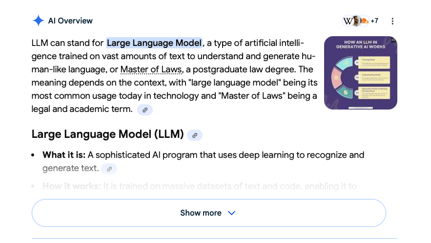

When I was in 6th grade, we often took 'trips' to the computer lab during science class. Towards the beginning of the year, we were conducting an ecological report on an animal of our choosing, and our teacher Mrs. Blake taught us a lesson about finding credible sources and citing them. Here were the basic tenants I learned:

✔️ Whenever possible, reference .edu and .gov sources

❌ Do not cite Wikipedia as your only source

✅ Look at Wikipedia's bibliography and click through to find the original sources

This was the first introduction to evaluating credibility that I can remember. It was rudimentary, but it was a start.

As I continued along my academic career, my evaluating credibility became more nuanced. For example, I realized that, although Mrs. Blake's instructions not to cite Wikipedia were sensible, it didn't mean Wikipedia was never credible or correct.

In fact, many times Wikipedia is credible and correct. Wikipedia articles are often written, developed, revised, and iterated-upon by nerds (like me) who are extremely passionate about niche topics—in addition to the fact that the citations for claims are often referenced in-text and with a bibliography below.

As I moved through high school and university, I learned that Wikipedia is not useless. It is a useful tool for finding information quickly, but it should not be the end-all and be-all of research.

A lot has changed about how information is gathered since I was in sixth grade. We had Google back then, but Google was not the same tool it is today. Natural language processing (NLP)—the technology behind search, language translation, voice assistants, and chatbots like ChatGPT and Gemini—was nowhere near its current capabilities.

What's more? It's rapidly accelerating. Rapidly.

Large Language Models (LLMs), an NLP technology, are beginning to appear everywhere. Sure, we interact with them when we are explicitly using a tool like ChatGPT, Gemini, or Copilot. However, they are also making their way into every aspect of our technological lives; we can find them on eCommerce websites (e.g. Rufus for Amazon), social media platforms (e.g. Grok for X), and even our Google Searches and email inboxes (e.g. Gemini for Search and Gmail). These tools are extremely helpful, and they can support efficiency in a world driven by extraordinary amounts of information.

However, these AI tools are starting to do much of our reading and researching for us. For example, a survey analysis by McKinsey found that people report that about 50% of their Google Searches begin with AI Summaries (like the one below), and this figure is projected to raise to 75% by 2028.

Not only do these summaries pop up, but research from the Pew Research Center (2025) found that while about 15% of people click through on a regular Google Search, only about 8% of people click through when they see an AI Summary. That suggests these AI summaries are reducing Google Searchers' direct interactions with sources by half.

This raises several questions: What happens when we stop reading sources directly? Can we trust these summaries, overviews, and reviews? How do we know whether the information we receive is correct?

## Why LLM training matters

The way LLMs are built and trained is an important part of answering these questions.

First, they are pre-trained on large-scale text datasets (for example, books, articles, and websites). In this phase, the model learns to predict the next word in a sentence, and from that it picks up grammar, style, and a broad base of world knowledge. Next, they are fine-tuned on more carefully curated, smaller datasets—often including example conversations and human feedback—to make them better at following instructions and performing specific kinds of tasks.

Where are these datasets coming from, though? This 'training data' (especially the pre-training data) comes from books, code repositories, and—you guessed it—large collections of website data. Remember that Reddit post you read that contained some really terrible health advice? Yes, posts that might have made its way in there.

The good news is that, for most everyday questions, the odds that one random bad Reddit post will completely skew an LLM’s answer is relatively low. These models are trained on massive amounts of text, so any single piece of non-credible information is usually drowned out by thousands of higher-quality examples. In that sense, they “average over” lots of sources and tend to reproduce the most common, consistent patterns they’ve seen.

That said, if misinformation is widespread, if a topic is niche or newly emerging, or if the training data underrepresents certain perspectives, the model’s output can absolutely be biased, incomplete, or just wrong. This is especially important in fields like LLMs in doctors' Electronic Health Records (EHRs), where bias from common language and text corpora may skew how medical information is 'interpreted.'

So, just because these LLMs might often be correct, they statistically will never always be correct, because they are inherently trained on data with varying levels of credibility.

## A simple method for checking information

As I reflect on this, I realize that the solution to this quandary may not be much different from the lessons I learned in 6th grade science class. Like Wikipedia, these LLMs are tools. And, like Wikipedia, these LLMs should not be the end-all-be-all for our research on any topic.

> The solution to this quandary may not be much different from the lessons I learned in sixth-grade science class.

The simple solution? Click through the link. Investigate the sources directly.

Many of the Modern LLMs offer sources with their answers. For example, Google's AI Overview has links, and ChatGPT will often conduct 'Web Browsing' and give links to cite its sources of information.

Simply clicking through to these links to check a claim by AI information is a great way to get a better idea of:

1. whether the source is credible/to what degree is the source credible (e.g. is it PubMed, or Quora?), and
2. whether the information seems grounded in logic, evidence, and reasoning, or emotion, opinion, and ulterior motives.

So, just like how I discovered there was more nuance and gray area between "Don't use Wikipedia" and "Trust everything Wikipedia says,"

I'm consistently discovering that there is more nuance and gray area between "Don't use AI" or "Use AI for everything." And, I'm consistently discovering that AI functions best as a research tool and a writing assistant, not as an entire researcher and writer.

## References

McKinsey & Company (2025). [New front door to the internet: Winning in the age of AI search](https://www.mckinsey.com/capabilities/growth-marketing-and-sales/our-insights/new-front-door-to-the-internet-winning-in-the-age-of-ai-search)

Pew Research Center (2025). [Google users are less likely to click on links when an AI summary appears in the results](https://www.pewresearch.org/short-reads/2025/07/22/google-users-are-less-likely-to-click-on-links-when-an-ai-summary-appears-in-the-results/)

## AI transparency note

In the interest of transparency regarding AI, 95% of this article was written by me and me alone. However, I leveraged ChatGPT to help me with a few paragraphs about how LLMs are trained and how they calculate outputs, because this is not my wheelhouse.