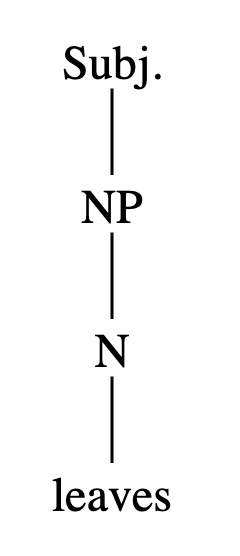
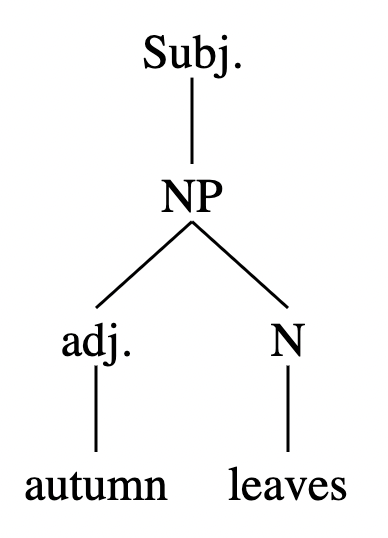
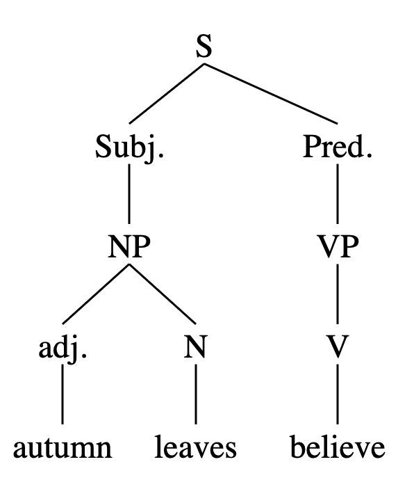
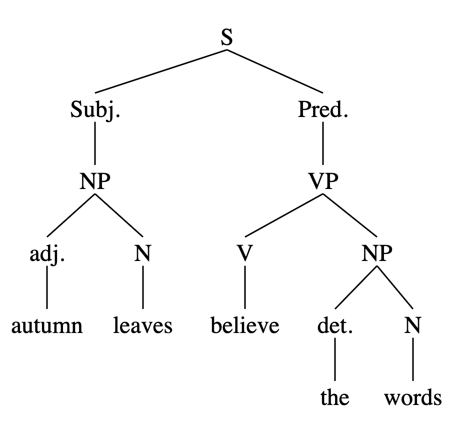
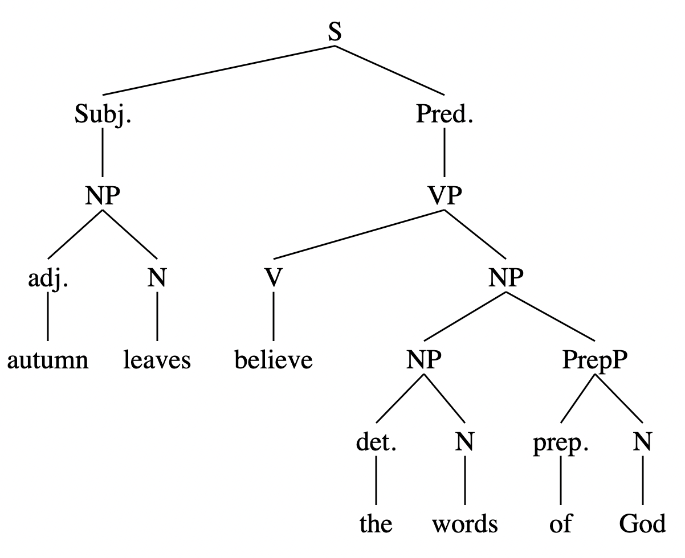
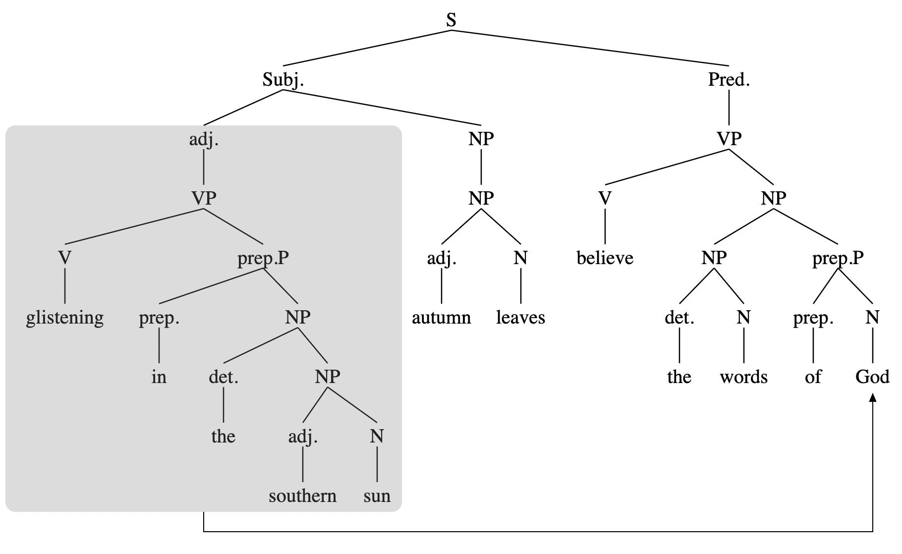

When writing poetry, it is still very beneficial for me to start with the basics.

When I sit down to write a poem, I often start with a subject. It’s simple this way. Often times I’ll start with a noun, like a sunflower, or leaves. Other times, when I really want to put forth the action and life of the poem up front, I’ll make the subject a verb phrase. Sometimes this means exploring big ideas with infinitives like “to live,” “to love,” “to pray,” or “to write;” other times I want more movement, so I use gerunds like “dancing,” “falling,” “dreaming,” or “leaving.”

After I have selected my subject, I must put it into action—tell the reader *what it is* or *what it does*. This is where I select my verb. The verb breathes life into the poem. The verb begins the predicate. A poem without a verb is stagnant—it is incomplete. In every poem there must be a subject, and there must be a verb that tells us something about what it is, what it does, or what it means. If I chose a noun as my subject, I must explore the life of that subject through the world of its action—through the realm of verbs. Does it glisten? Does it gleam? Does it believe?

In many cases, then, leading from the verb, I bridge the gap of my subject into the world in which it belongs; I set it in context with the rest of the world—this object is the soil to the sprout, the horizon to the sunset, the leaves to the wind.

Let us write a poem—here, together—to illustrate the magical grammar—the powerful forces behind its creation. We will start with our subject. To refer to a previous example, let us select the noun *leaves*:

*leaves*

And, to make it more compelling—to draw in the reader, let us further define our subject with an adjectival—a descriptor—*autumn*:

*Autumn leaves*

*Autumn leaves*, a subject upon which novels could be written! The glisten and the burn. But for now, our next step is simply to write a verb—the first life-breath of the poem. Let us vitalize these autumn leaves, personifying their brilliance.

*Autumn leaves believe*

And the dance begins. If we wanted, we could leave the poem right here, and we could call it complete. A subject and a verb—that’s all we actually *need*. And yet, we also can keep dancing, bringing magic to these lines. Let us add an object—let us tell of these leave’s beliefs.

*Autumn leaves believe the words*

Who’s words do these leaves believe? A prepositional phrase will help us to specify:

*Autumn leaves believe the words of God*

In this way we continue, playing with the language, bringing our subject to life. What can we say about this subject that our reader can relate to? How can we speak of this subject in a way that reveals more about life and the human experience as a whole? We might append a participle phrase, telling more about the subject:

*Autumn leaves believe the words of God, glistening in the southern sun.*

And thus we find poetry, deeply entwined with the grammatical structures that are built into our minds as deeply as the need to sleep or eat.

---

*This essay was originally written for Dr. Ian Ying’s ENGL 2070 course in October 2015.*
